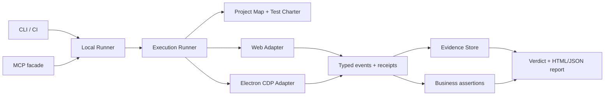

# ProofKit AI

**Evidence-driven system testing for web and Electron.**

ProofKit turns a short product instruction into a reviewable test charter, runs it against a real browser or Electron app, observes the result, and stores the evidence behind every verdict.

It is designed for workflows where a green button is not enough: a resume must be acquired, parsed, attached to the right candidate and position, and reach the expected terminal state. ProofKit is local-first and uses independent business facts where available.

> Early development: the first vertical slice supports Chromium-based Web and Electron applications. CLI and data formats are still evolving.

## What it does

- Maps workspace manifests and common Web, Electron, and backend entry points.
- Converts intent into a saved YAML Test Charter that can be reviewed and edited.
- Executes Web and Electron actions through Playwright, including CDP attachment.
- Starts local project processes with health checks and captures runtime events in the same run timeline.
- Observes read-only business HTTP endpoints through a redacted oracle instead of treating a UI click as proof of success.
- Records action receipts, before/after snapshots, network and console events, screenshots, and a JSONL timeline.
- Reports `passed`, `failed`, `blocked`, or `inconclusive`; missing evidence never becomes a pass.
- Produces local JSON and HTML reports without a hosted service.

## Quick start

Requirements: Node.js 22 or newer and pnpm 10.

```bash
pnpm install
pnpm build
pnpm --filter @proofkit/cli dev -- init --root /path/to/your/project
pnpm --filter @proofkit/cli dev -- doctor --root /path/to/your/project
```

Plan and review a test:

```bash
pnpm --filter @proofkit/cli dev -- plan \
  "Verify the resume page shows a successful result" \
  --url http://127.0.0.1:5173 \
  --expect "Resume ready" \
  --out resume-check.yaml
```

Run it in Chromium:

```bash
pnpm --filter @proofkit/cli dev -- run "resume check" \
  --root /path/to/your/project \
  --charter resume-check.yaml \
  --adapter web \
  --headful
```

Attach to an existing Electron instance. Start that app with remote debugging enabled and point ProofKit at its loopback CDP endpoint or `DevToolsActivePort` file:

```bash
pnpm --filter @proofkit/cli dev -- run "resume check" \
  --root /path/to/your/project \
  --charter resume-check.yaml \
  --adapter electron \
  --devtools-port-file /path/to/user-data/DevToolsActivePort
```

Runs are stored under `.proofkit/runs/<run-id>/` by default. Each run contains `run.json`, `events.jsonl`, artifacts, and `report.html`.

For an AI client, build and register the optional local MCP server. It exposes only project discovery, charter planning, run start, status, bounded evidence, and replay, and it uses the same Local Runner as the CLI. MCP does not execute the configured project start command; start your test environment first:

```bash
pnpm --filter @proofkit/mcp build
PROOFKIT_ROOT=/path/to/your/project node packages/mcp/dist/server.js
```

## Architecture



The repository is a pnpm workspace with explicit package boundaries:

| Package | Responsibility |
| --- | --- |
| `@proofkit/contracts` | Runtime schemas for charters, actions, receipts, events, evidence and verdicts |
| `@proofkit/project` | Project scan, `doctor` inputs, local configuration |
| `@proofkit/planner` | Deterministic intent scaffolding and YAML charter validation |
| `@proofkit/runner` | Execution lifecycle, step receipts, assertions and verdicts |
| `@proofkit/adapters` | Playwright Web and Electron CDP surfaces |
| `@proofkit/evidence` | JSONL timeline, artifacts, redaction and static report data |
| `@proofkit/local-runner` | Shared CLI/MCP/CI orchestration, status, replay and evidence lookup |
| `@proofkit/mcp` | Narrow MCP facade over the shared Local Runner |
| `@proofkit/cli` | Local user interface and CI entry point |

## Verdicts

| Verdict | Meaning |
| --- | --- |
| `passed` | Every declared business assertion passed against an observed state. |
| `failed` | An action or assertion produced a concrete failure. |
| `blocked` | An explicit human, permission, authentication, or environment condition stopped execution. |
| `inconclusive` | Execution ended without enough business assertions to prove success or failure. |

Screenshots are supporting evidence. They do not override failed API, worker, file, or business-state assertions.

## Safety and data

- Use a dedicated test profile and test data. CDP attachment controls the selected browser session.
- Keep CDP bound to loopback; never expose a debugging port to a public network.
- ProofKit does not seed or mutate databases in the first release. Project-specific write operations must be explicit, typed capabilities in a later extension.
- Authorization, cookies, passwords, secrets, tokens, and phone fields are redacted from structured evidence by default.
- Do not use production accounts or real candidate data for exploratory runs.

## Development

```bash
pnpm install
pnpm build
pnpm typecheck
pnpm test
node tests/web-smoke.mjs
node tests/electron-smoke.mjs
```

The Electron smoke test uses an isolated temporary profile. The Web smoke test serves a local fixture page. Neither contacts a production system.

## Design principles

1. Reuse mature execution engines; focus on project understanding, cross-layer observation, business oracles and evidence.
2. Keep CLI, MCP and CI attached to the same local Runner and result model.
3. Persist every natural-language plan as a reviewable Test Charter.
4. Distinguish action receipts from assertions: an action receipt proves dispatch, not business success.
5. Keep the core deterministic and make AI planning an optional provider behind a validated schema.

See [docs/architecture.md](docs/architecture.md) for package boundaries, extension points, and the first end-to-end vertical slice. See [docs/research.md](docs/research.md) for the open-source project comparison and reuse decisions. See [docs/aihr-resume-integration.md](docs/aihr-resume-integration.md) for the first business-flow integration contract.

## License

MIT. See [LICENSE](LICENSE).
